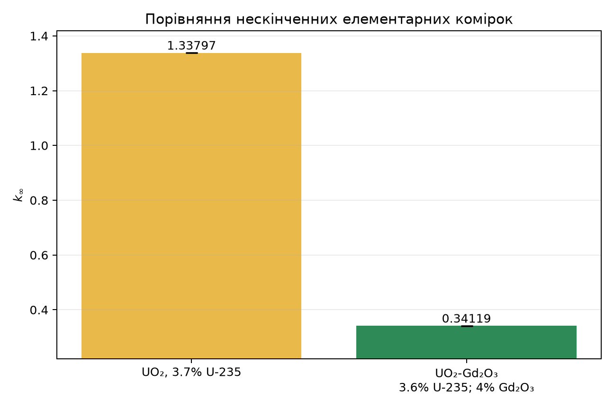
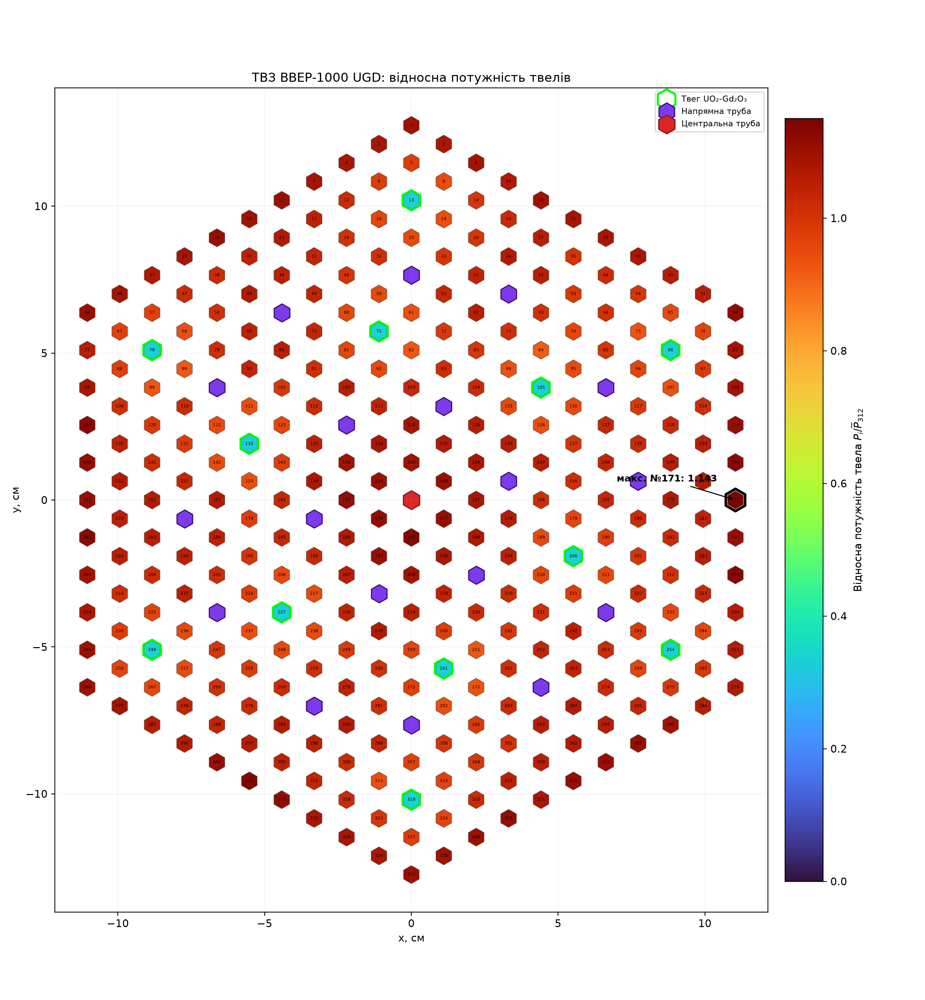
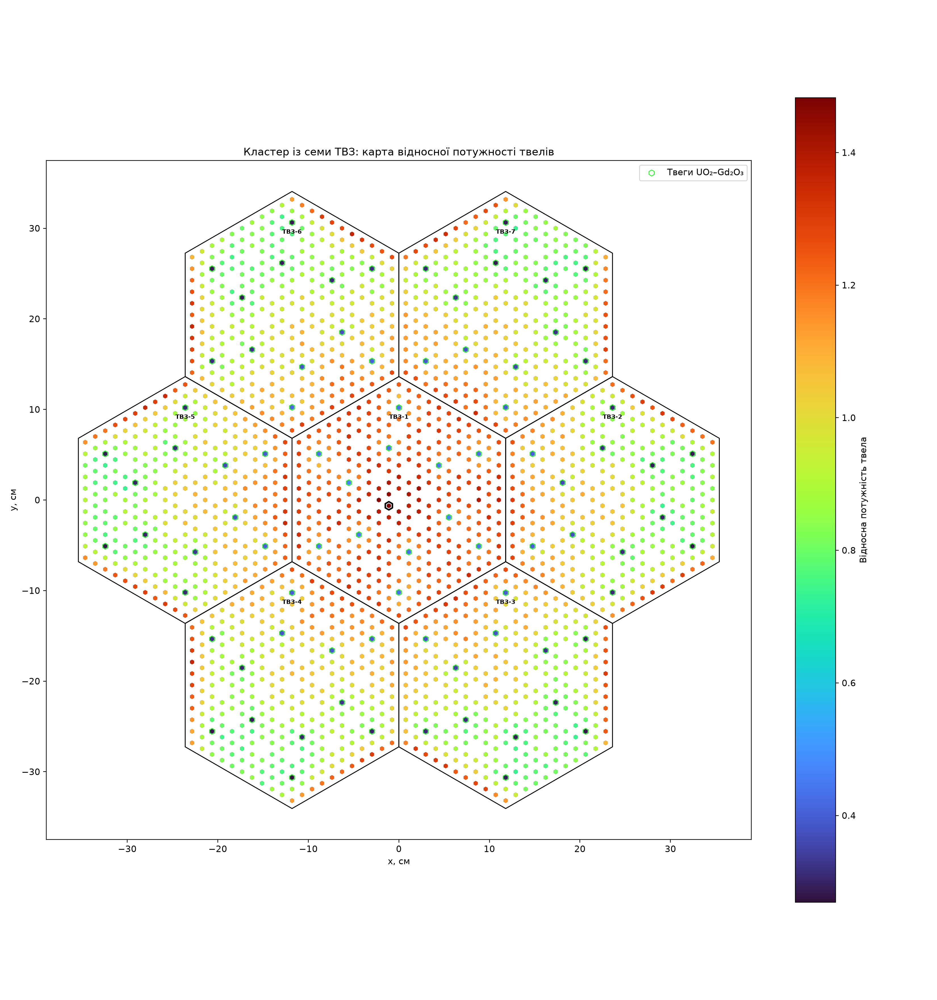
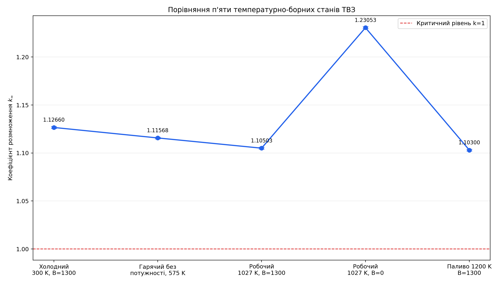

# Приклади результатів / Example results

Ця папка містить невеликі результати завершених розрахунків, використаних у
[п'ятисторінковому технічному звіті](../docs/zvit_openmc_tvel_tvz_7tvz_20260823_uk.docx).
Повні HDF5, XML, XLSX і журнали OpenMC навмисно не включено до Git.

## Опубліковані набори

| Папка | Вихідний запуск | Ключовий результат |
| --- | --- | --- |
| [`01_pin_compare`](01_pin_compare/) | Порівняння UO₂ та UO₂–Gd₂O₃, 12.08.2026 | `k_inf`: 1.337969 та 0.341186 |
| [`02_assembly_331_2d`](02_assembly_331_2d/) | `20260812_123835_UGD_331_S4_fresh` | `k_inf` = 1.243809; `K_pin` = 1.142546 |
| [`03_cluster_7_2d`](03_cluster_7_2d/) | `20260823_164125_klaster7_robochyi_Tfuel1027_Twater575_B1300` | `k_inf` = 0.977475; `K_pin` = 1.482722 |
| [`04_assembly_states`](04_assembly_states/) | Порівняння п'яти станів, 12–13.08.2026 | `k_inf` від 1.103004 до 1.230533 |

## Що міститься в папках

- `pidsumok_rozrakhunku.json` — компактний підсумок і статистичні похибки;
- `vykorystani_parametry.json` — точні параметри відповідного запуску;
- `*.csv` — інтегральні реакції, спектри та розподіли потужності;
- `*.png` — геометрія та основні графіки.

## Відтворюваність

Результати створено в OpenMC 0.15.3 із бібліотекою ядерних даних ENDF/B-VIII.0.
Перед використанням чисел у публікації прочитайте примітки щодо статистичних
похибок і модельних обмежень у JSON та технічному звіті.

---

These directories contain compact outputs from completed runs used in the
five-page Ukrainian report. They include CSV, JSON, and PNG files only. Full
HDF5 statepoints, generated XML, spreadsheets, and logs remain outside Git.
